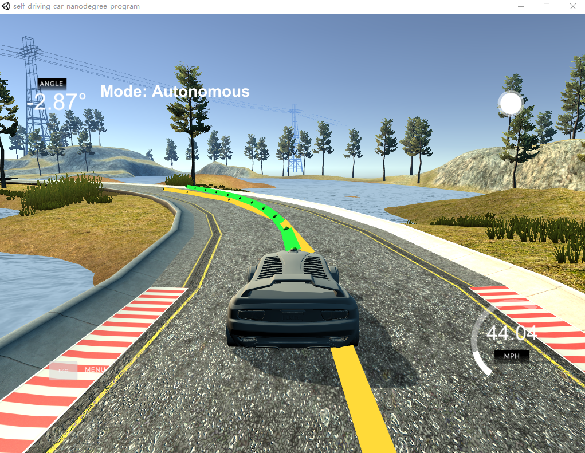

# CarND-Controls-MPC
Udacity Self-Driving Car Engineer Nanodegree Program, Term 2 ,Project 5 - Controls MPC

## Project Basics
This project is write by C++.

This project involves the Term 2 Simulator.

## Parameters

N is set to 12 and dt is set to 0.1.

latency_ind is set to 2.

Tuning MPC cost to get a smoother curve:

 fg[0] += 500*CppAD::pow(vars[delta_start + i + 1] - vars[delta_start + i], 2);

 fg[0] += 5*CppAD::pow(vars[a_start + i + 1] - vars[a_start + i], 2);

 And I change the f and psides parameter which get a better result:

 AD<double> f0 = coeffs[0] + coeffs[1] * x0 + coeffs[2] * CppAD::pow(x0, 2) + coeffs[3] * CppAD::pow(x0, 3);

 AD<double> psides0 = CppAD::atan(coeffs[1] + 2 * coeffs[2] * x0 + 3 * coeffs[3] * CppAD::pow(x0, 2));

## Basic Build Instructions

1. Clone this repo.
2. Make a build directory: `mkdir build && cd build`
3. Compile: `cmake .. && make`
4. Run it: `./mpc`. 

## Result
